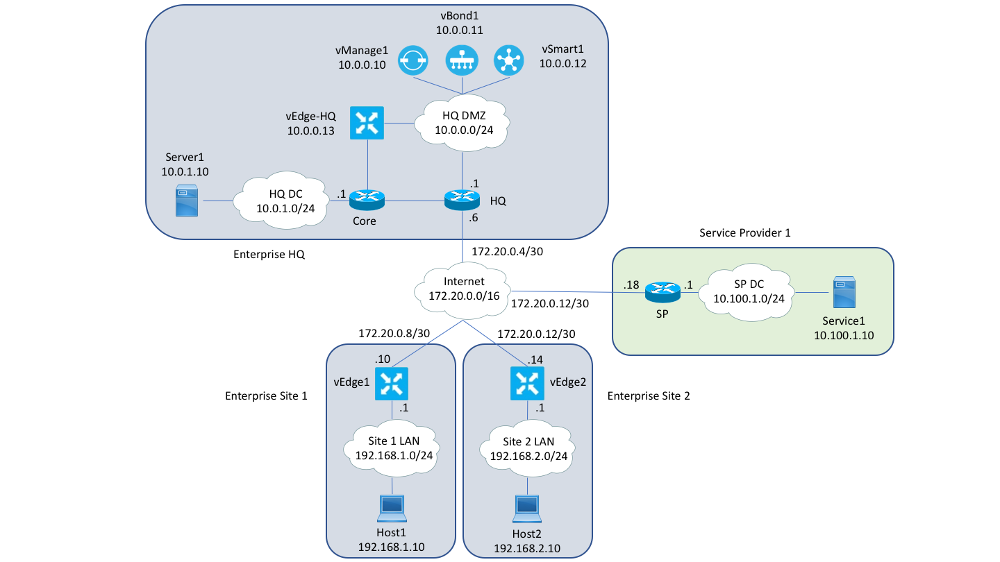

# sd-wan-ansible-pipeline-code
This collection of Ansible inventory and playbooks is designed to be used with the DevNet Learning Module [Cisco SD-WAN Ansible Pipeline](https://developer.cisco.com/learning/modules/sd-wan-ansible-pipeline) and the DevNet [Multi-IOS Cisco Test Network](https://devnetsandbox.cisco.com/RM/Topology) sandbox.  However, it can also be applied to any VIRL server that has the appropriate Cisco SD-WAN images installed.

## Requirements
- VIRL server with vManage, vSmart, vBond and vEdge images installed.  For instructions on how to do this, look at the [virl-howtos](https://github.com/CiscoSE/virl-howtos) repo.
- [sshpass](https://sourceforge.net/projects/sshpass/) installed

## Installation
Clone the repo.  Note the use of the recursive switch.  This is to make sure the necessary submodules get pulled down as well.
```
git clone --recursive https://github.com/CiscoDevNet/sd-wan-ansible-pipeline-code.git
```
Change into the sd-wan-ansible-pipeline-code directory.
```
cd sd-wan-ansible-pipeline-code
```
Install the required Python modules.
```
pip install -r requirements.txt
```
## Topology
The Ansible inventory data included in this repo is designed to build and configure the following topology:



## Playbooks
There are seven playbooks in this collection:
- **build.yml** builds the dynamic VIRL topology file and starts the simulation
- **configure.yml** pushes the Day 1 configuration to devices via NETCONF
- **import-templates.yml** imports device/feature templates into vManage
- **export-templates.yml** writes device/feature templates from vManage to a local YAML file
- **attach-template.yml** attaches device templates to devices
- **detach-template.yml** detaches device templates from devices
- **clean.yml** cleans up file and stops the simulation

## Basic usage
Build the topology.
```
ansible-playbook build.yml
```
Bring up the control plane and basic device connectivity.
```
ansible-playbook configure.yml
```
Import device/feature templates into vManage
```
ansible-playbook import-templates.yml
```
Attach device templates to devices.
```
ansible-playbook attach-template.yml
```
When you're done, cleanup.
```
ansible-playbook clean.yml
```
## Adding a site to the topology
Ensure you are starting with clean directory and no simulation running.
```
ansible-playbook clean.yml
```
Copy a new viptela-workshop.yml file with the additional branch site into the inventory directory.
```
cp inventory_files/viptela-workshop-2branch.yml inventory/viptela-workshop.yml
```
Build the topology.
```
ansible-playbook build.yml
```
Bring up the control plane and basic device connectivity.
```
ansible-playbook configure.yml
```
Import device/feature templates into vManage
```
ansible-playbook import-templates.yml
```
Attach device templates to devices.
```
ansible-playbook attach-template.yml
```
> Note: It can take some time for vEdges to register in vManage, trying to run the attach-template.yml playbook before the vEdge is registered in vManage will result in an error.
## Updating a device banner
Copy a new network.yml file with an updated banner into the vedge1 directory.
```
cp inventory_files/vedge1_network.yml inventory/host_vars/vedge1/
```
Reattach the device template to vedge1
```
ansible-playbook attach-template.yml --limit=vedge1
```
## Useful tips
1. Use `virl nodes` to find node management IP addresses.
1. When running the attach-template.yml playbook, you can limit the playbook to a specific node (e.g `--limit=vedge1`).
1. When running the configure.yml playbook, you can limit the playbook to just control plane or just edge with `--limit=control` and `--limit=edge`.